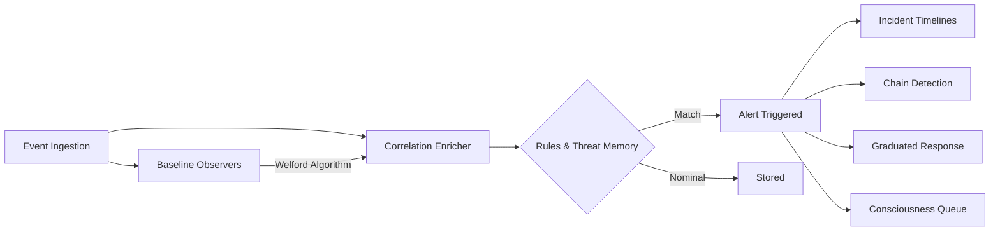

# Architecture Overview

Ethernull employs a rigid **three-tier architecture** designed for high throughput, security, and low latency. The entire system communicates asynchronously via WebSocket with a structured protocol envelope.

## Three-Tier Architecture

The system is categorized into three distinct roles:

1. **Agent (Hive Entrance):** Deployed on the endpoint. It functions autonomously up to a certain degree, streaming events, keeping heartbeat state, and processing local analytics before escalating via the connection.
2. **Gateway:** The forward-facing relay. It manages mTLS connections with Agents and routes messages opaquely back to the Core. The Gateway enforces identity verification (`cert_cn`) at the perimeter boundaries.
3. **Core (The Brain):** The central intelligence. Encompasses the correlation engines, LLM consciousness, database states, and graduated response evaluators.

```mermaid
graph TD
    A1[Agent "Workstation-Alpha"] <-->|mTLS WebSocket| G[Gateway Relay]
    A2[Agent "Server-Bravo"] <-->|mTLS WebSocket| G
    A3[Agent "Laptop-Charlie"] <-->|mTLS WebSocket| G
    
    G <-->|WebSocket| C[Core Hive Brain]
    C --> DB[(PostgreSQL)]
```

## Message Flow

All communication originates at the Agent. Core never reaches out to bind against Agents directly, circumventing NAT and firewall complexities.

1. **Connection Initiation:** Agent connects to the Gateway.
2. **Identity Verification:** Gateway validates mTLS certificate properties.
3. **Registration:** Agent sends a `REGISTER` message through the Gateway. The Gateway manipulates the sender with a temporary `conn_id` to route the Core `ACK` packet back.
4. **Persistent Relay:** Upon ACK, the Gateway maps `agent_id` back to the raw WebSocket and serves as a strict bidirectional pipe.
5. **Commands:** When Core commands an Agent, the instruction flows in reverse along the same persistent WebSocket path.

## Message Types

Communication envelopes carry one of the following wire-protocol `MessageType` identifiers:

**Agent to Core:**
- `REGISTER`: Initial connection handshake containing identity and capabilities.
- `HEARTBEAT`: 10-second recurring pulse payload, carrying piggybacked /proc metrics.
- `EVENT`: Endpoint activity triggers (process forks, network connects, FIM).
- `COMMAND_RESULT`: Outcomes of a requested remote action.
- `DIRECTIVE_RESULT`: Completion confirmation for a multi-stage directive.
- `LOCKDOWN_REPORT`: Hardening posture response.
- `LOG_BATCH`: Aggregated system logs.

**Core to Agent:**
- `COMMAND`: Direct, immediate task instruction (e.g., Isolate).
- `CONFIG_UPDATE`: Silent pushing of new detection strategies or parameters.
- `DIRECTIVE`: Multi-stage behavior profiles sent to the endpoint.
- `ACK`: Standard system-level receipt.

## Command Types

The Core dictates Agent behavior using the `CommandType` enumerations:

- `ANALYZE`, `COLLECT`, `AUDIT`, `REPORT` (Reconnaissance and evaluation)
- `CONFIGURE`, `ROTATE`, `UPGRADE` (State modification)
- `ISOLATE`, `QUARANTINE`, `HEAL`, `EXEC` (Direct interventional response)
- `PHANTOM` (Self-triggered Red-Team execution sequences)

## Data Flow Diagram

When an Agent pushes a raw event, the pipeline manages it through several parallel analytic engines:



## Core Startup Sequence

To ensure stable threat evaluation, the Hive Core boots with precise dependency ordering defined in its FastAPI lifespan sequence:

1. **Database Allocation:** `init_db()` alongside async migrations using Alembic.
2. **State Hydration:** Loads disconnected states, threat indicators, baseline memories, and audit method definitions into RAM.
3. **Dispatcher Initialization:** Instantiates the Command, Phantom, and Policy engines.
4. **Risk Topologies:** Wires the global Risk Engine mapping components.
5. **Background Schedulers:** Activates the Audit Schedule, Feed Schedule, Heal Schedule, and Graduated Engine loops.
6. **Consciousness Activation:** Finalizes initialization by igniting the LLM analysis priority queues and the optional Telegram Operator Bot. 
